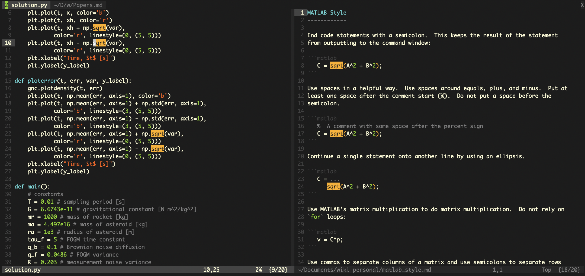

# nvim

This is my init file, color scheme, and cheat sheet for Neovim (or Vim).

## Init File

The init file configures multiple settings in Neovim, creates multiple mappings
and abbreviations, and includes a cheat sheet for Vim (in comment form).  Some
of the mappings include specifically

   -  *ctrl-h* hide all search highlights
   -  *ctrl-s* save current file in normal and insert modes
   -  *ctrl-q* close current file or terminal instance
   -  *ctrl-z* toggle spelling in normal and insert modes
   -  *ctrl-k* multi-file search for word under cursor or selected text
   -  *ctrl-p* search for file by name under cursor
   -  *ctrl-c* toggle colorcolumn at line 81 in normal and insert modes

## Color Scheme

The color scheme is designed specifically for use in the terminal, not a GUI,
hence the name: cterm8.  It is designed to explicitly specify each scheme
setting so that no settings are inherited from previous scheme choices.  The
design choices focus on creating a clean, consistent style that keeps the
content as the focus and makes the framework subtle.

8-bit colors, rather than the 3-bit named colors, were chosen in order to give a
consistent appearance across terminal emulators and to provide more choices in
color.  Also, although most terminals support 256 colors (8-bit), some (macOS
builtin Terminal) do not support millions of colors.  The 8-bit grays range from
232 to 255.  The chosen colors are listed here:

   | Name         | Value       | Name         | Value |
   | ------------ | ----------- | ------------ | ----- |
   | black        | 234         | cyan         | 080   |
   | dark gray    | 235         | green        | 112   |
   | gray         | 238         | yellow       | 214   |
   | light gray   | 244         | magenta      | 170   |
   | white        | 230         | red          | 202   |

In an attempt to maintain some consistency, yellow is used to highlight current
search selections.  Red is used for errors.  Green is used for literals and
non-search highlights.  Cyan is used for keywords that mean something in the
given language.  Magenta is used for macros and special characters like '\n'.

Color is well supported by most terminals, but bold, italics, and underline are
not as well supported.  Consequently, this color scheme makes no use of the
'cterm' option, and sets it to 'none' everywhere.

Color schemes define coloring based on groups.  Some of the color groups are
used by the file type for syntax highlighting of the text.  Other color groups
are used by the interface for coloring aspects such as the status bar, search
results, or the tabs.  Several of the explanatory comments here are taken
directly from Vim's help files.

Some groups will not have any effect on the syntax highlighting, but this is due
to the syntax definition file for that file type not linking the appropriate
syntax group to the highlight group.  The builtin C syntax file, for example,
does not link to the following highlight groups: Boolean, Identifier, Function,
Operator, Exception, and Define.
